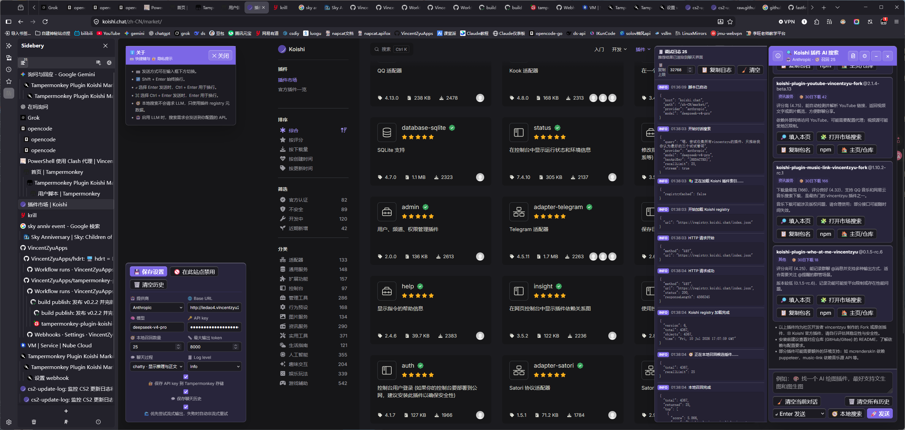

> 建议前往 [GitHub README](https://github.com/VincentZyuApps/tampermonkey-plugin-koishi-market-ai-helper#readme) 或 [Gitee README](https://gitee.com/vincent-zyu/tampermonkey-plugin-koishi-market-ai-helper#readme) 阅读完整说明。

> 前往 [Greasy Fork](https://greasyfork.org/zh-CN/scripts/586466-tampermonkey-plugin-koishi-market-ai-helper) 安装脚本到当前浏览器。

# 🔍 Tampermonkey Plugin Koishi Market AI Helper

<a href="https://github.com/VincentZyuApps/tampermonkey-plugin-koishi-market-ai-helper"></a>
<a href="https://gitee.com/vincent-zyu/tampermonkey-plugin-koishi-market-ai-helper"></a>

<a href="https://greasyfork.org/zh-CN/scripts/586466-tampermonkey-plugin-koishi-market-ai-helper"></a>

Koishi 插件市场的 AI 对话式搜索助手。脚本以 TypeScript 编写，通过 Vite 和 `vite-plugin-monkey` 构建为单文件 userscript。

作者：VincentZyu <1830540513zyu@gmail.com>

## 🖼️ 预览



## 🧩 一键安装

发布 Release 后，可以用 latest 直链安装：

```text
https://github.com/VincentZyuApps/tampermonkey-plugin-koishi-market-ai-helper/releases/latest/download/tampermonkey-plugin-koishi-market-ai-helper.user.js
```

发布 GitHub Pages 后，可以用固定地址安装：

```text
https://vincentzyuapps.github.io/tampermonkey-plugin-koishi-market-ai-helper/tampermonkey-plugin-koishi-market-ai-helper.user.js
```

## 🌐 分发渠道说明

GitHub Release 是版本归档和 changelog 主渠道。

GitHub Pages 是固定安装 URL，适合后续作为 `@downloadURL` / `@updateURL` 候选。

Greasy Fork 和 OpenUserJS 更适合在平台侧配置 GitHub 同步或 webhook；当前 workflow 不直接携带平台账号 token 上传。

GitHub / Gist Raw 指的是用户直接访问 Raw `.user.js` 安装。当前项目不提交 `dist/`，所以正式安装优先使用 Release 或 Pages。

## 🔐 隐私与网络请求

脚本会读取 Koishi 插件市场 registry 元数据，用于本地启发式召回和候选插件排序。

默认 registry 地址：

```text
https://registry.koishi.chat/index.json
```

当用户发起 AI 对话搜索时，脚本会把用户输入的搜索需求和本地召回出的候选插件摘要发送到用户配置的 LLM API。

脚本默认支持：

```text
OpenAI-compatible
Anthropic-compatible
```

默认 OpenAI-compatible base URL 是：

```text
https://api.deepseek.com
```

用户可以在设置里改成自己的中转站或其他兼容服务。

API key 默认可保存到 Tampermonkey 本地存储，也可以取消保存，仅在当前页面会话中使用。

聊天历史默认不保存；如果用户在设置中开启历史保存，历史会写入 Tampermonkey 本地存储。

脚本不会主动上传 Koishi 登录凭据，也不会读取 Koishi 控制台的账号密码。

由于脚本支持自定义 LLM base URL，userscript metadata 中使用了较宽的跨域配置。

实际请求只会在以下场景发生：

1. 加载 Koishi registry。
2. 用户点击发送并启用 LLM 请求。
3. 用户点击插件卡片中的 npm、主页、仓库或市场搜索入口。
4. 用户配置了自定义 LLM base URL 后，向该 URL 发送请求。

## 🧰 环境要求

- Node.js 24+
- npm 11+
- Tampermonkey 或 Violentmonkey

## 📜 常用 npm scripts

| 命令 | 作用 |
| --- | --- |
| `npm install` | 安装依赖并生成/更新 `node_modules` |
| `npm ci` | 按 `package-lock.json` 干净安装，适合 CI |
| `npm run dev` | 启动 Vite 开发服务 |
| `npm run build` | 构建 userscript 到 `dist/` |
| `npm run typecheck` | 执行 `tsc --noEmit` |
| `npm run syntax` | 对构建后的 `.user.js` 执行 `node --check` |
| `npm run check` | 类型检查 + 构建 + 语法检查 |

## 📦 安装依赖

```bash
npm install
```

如果本机 npm 全局缓存目录权限异常，可以临时使用项目内缓存：

```bash
npm install --cache ./.npm-cache
```

CI / GitHub Actions 使用 lockfile 安装：

```bash
npm ci
```

## 🛠️ 开发

启动 Vite 开发服务：

```bash
npm run dev
```

入口文件在：

```text
src/mainEntry.ts
```

Tampermonkey 元数据配置在：

```text
vite.config.ts
```

## 🏗️ 构建

生成 userscript：

```bash
npm run build
```

构建产物：

```text
dist/tampermonkey-plugin-koishi-market-ai-helper.user.js
```

`dist/` 不提交到 git，由本地构建或 GitHub Actions 生成。

## ✅ 检查

只做 TypeScript 类型检查：

```bash
npm run typecheck
```

检查生成后的 userscript 语法：

```bash
npm run syntax
```

完整检查：

```bash
npm run check
```

`npm run check` 会依次执行：

```bash
npm run typecheck
npm run build
npm run syntax
```

## 🔖 版本更新

项目版本以 `package.json` 为准。

正常情况下只需要让 npm 修改版本，不要手动改 `vite.config.ts`。

当前版本流向：

1. `package.json` 保存项目版本。
2. `package-lock.json` 保存 lockfile 中的项目版本快照。
3. `vite.config.ts` 会读取 `package.json`，构建时写入 userscript 的 `@version`。
4. GitHub Actions 会读取 `package.json`，默认生成 `v<package.json version>` Release tag，例如 `v0.2.3-beta.3`。
5. `dist/` 是构建产物，不提交到 git。

推荐用 `npm version` 更新版本：

```bash
npm version patch --no-git-tag-version
npm version minor --no-git-tag-version
npm version major --no-git-tag-version
npm version 0.2.3-beta.3 --no-git-tag-version
```

含义：

| 命令 | 行为 |
| --- | --- |
| `npm version patch --no-git-tag-version` | 自动递增补丁号，例如 `0.2.1` -> `0.2.2` |
| `npm version minor --no-git-tag-version` | 自动递增次版本号，例如 `0.2.1` -> `0.3.0` |
| `npm version major --no-git-tag-version` | 自动递增主版本号，例如 `0.2.1` -> `1.0.0` |
| `npm version 0.2.3-beta.3 --no-git-tag-version` | 指定精确版本号，例如发布 beta 版本 |

`patch` 不是占位符，不能写成指定版本；它表示“按 semver 规则递增 patch 位”。

如果要指定版本号，直接写目标版本号，例如 `0.2.3-beta.3`。

预发布版本可以使用 SemVer prerelease 格式，例如：

```bash
npm version 0.2.3-alpha.1 --no-git-tag-version
npm version 0.2.3-beta.3 --no-git-tag-version
npm version 0.2.3-rc.1 --no-git-tag-version
npm version 0.2.3-beta.3.20260710 --no-git-tag-version
```

其中 `alpha`、`beta`、`rc` 都是常见 prerelease 标识，后面的 `.1`、`.3` 或 `.20260710` 是 prerelease 序号或批次标记。

不要依赖 `+build` 元数据保存日期，例如 `npm version 0.2.3-beta.3+20260710 --no-git-tag-version` 会被 npm 规范化为 `0.2.3-beta.3`，`+20260710` 不会写入 `package.json`。

`npm version` 会同步更新 `package.json` 和 `package-lock.json` 中的项目版本。

这里使用 `--no-git-tag-version`，表示只改文件，不自动创建 git commit 和 tag。

如果已经手动改过 `package.json`，可以用下面的命令只刷新 lockfile：

```bash
npm install --package-lock-only
```

`npm install --package-lock-only` 只更新 `package-lock.json`，不安装依赖，也不改 `node_modules`。

## 🚀 提交前流程

普通开发提交前建议执行：

```bash
npm run check
git status
git diff HEAD --stat
git add -A
git commit -m "word: 描述本次变更 (build action)"
git push origin main
```

发 GitHub Release 或发布 GitHub Pages 时使用：

```bash
# 修改版本号
# 示例版本可换成 0.2.3-alpha.1、0.2.3-beta.3、0.2.3-rc.1 或 0.2.3-beta.3.20260710
npm version 0.2.3-beta.3 --no-git-tag-version
npm run check
git add -A

# 二选一：发布 Release
git commit -m "build release: release v0.2.3-beta.3"

# 二选一：发布 Release 并部署 Pages
git commit -m "build publish: release and deploy userscript page"
git push origin main
```

## ⚙️ GitHub Actions

GitHub Actions 会在 push 到 `main` 或 `master` 时运行，详细行为矩阵、提交关键词、Release assets 和 Greasy Fork webhook 配置见 [GitHub Actions 发布说明](./.github/workflows/publish.md)。

## 📄 许可证

本项目使用 MIT License。

详见 [LICENSE](./LICENSE)。
